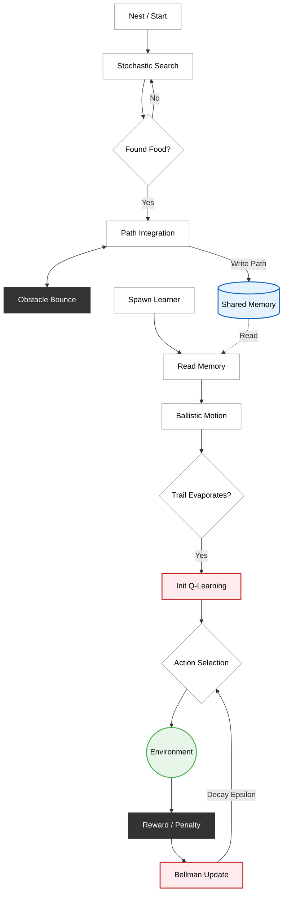
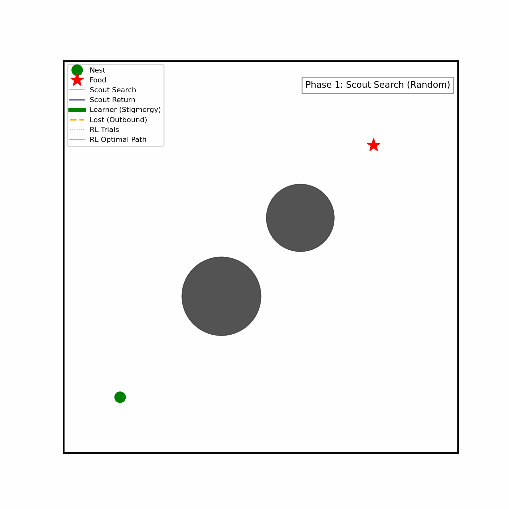

# Bio-Inspired Navigation: Hybridizing Stigmergy and RL in Multi-Agent Systems

**Author:** *Sriram S Rajan*  
**Submitted to:** *Dr. Ganga Prasath S & Dr. Danny Raj M*  
**Department of Applied Mechanics and Biomedical Engineering, IIT Madras**

---

## Abstract

This project implements a **hybrid multi-agent navigation system** that combines **stigmergic communication** with **Reinforcement Learning (Q-Learning)** for robust path planning. Inspired by the desert ant *Cataglyphis bicolor*, the system demonstrates **one-shot learning** through environmental memory and **adaptive recovery** when trails evaporate, using the Bellman equation to learn optimal obstacle-avoiding paths.

*Three agents showcase distinct behaviors: a scout discovers and maps terrain, a learner exploits shared knowledge instantly, and a lost agent recovers autonomously through trial-and-error learning.*

---

## Biological Inspiration

Based on: *"How Ants Use the Sun to Find Food — Trials of Life — BBC Earth"*

The ***Cataglyphis*** ant survives in the scorching Sahara where pheromone trails vanish instantly in extreme heat. Unable to follow chemical scents, these ants rely on **Path Integration** (Dead Reckoning) to navigate featureless deserts and return home directly.

### Core Navigation Mechanisms

| Mechanism | Function | Biological Implementation |
|-----------|----------|--------------------------|
| **Skylight Polarization Compass** | *Orientation* | Dorsal Rim Area detects polarized light via Rayleigh scattering |
| **Proprioceptive Odometry** | *Distance Estimation* | Physical step counting via leg proprioception |
| **Vector Integration (Homing Vector)** | *Path Calculation* | Continuous vector summation: $\vec{H} = \sum_{i=0}^{N} d \cdot [\cos(\theta_i), \sin(\theta_i)]$ |

*This project translates these biological principles into computational algorithms augmented with machine learning.*

---

## System Architecture

### Agent Classification

The system demonstrates three distinct behavioral modes representing different aspects of swarm intelligence:

| Agent Type | Role | Behavioral Strategy |
|------------|------|---------------------|
| **Scout (Ant 1)** | *Explorer* | Random search + path integration + obstacle avoidance |
| **Learner (Ant 2)** | *Recruit* | Stigmergic one-shot learning via memory access |
| **Lost Agent (Ant 3)** | *Adaptive Navigator* | Outbound stigmergy + inbound Q-Learning recovery |

### Information Flow: Stigmergy + Reinforcement Learning



---

## Algorithmic Framework

### Phase 1: The Scout (Explorer)
The Scout initializes with no prior knowledge and performs three sub-behaviors:

* **Stochastic Search:** The ant initiates a random walk where the heading $\theta$ is sampled continuously from a uniform distribution:
    $$\theta \in [0, 2\pi)$$

* **Path Integration:** It tracks global displacement by summing step vectors to calculate the Homing Vector $\vec{H}$:
    $$\vec{H} = \sum_{i=0}^{N} d \cdot [\cos(\theta_i), \sin(\theta_i)]$$

* **Odor-Gated Anemotaxis:** Upon detecting the food scent, it switches behavior. Instead of following a trail, it surges **upwind** (towards the wind source). The heading is biased toward the upwind direction ($\theta_{upwind}$):
    $$\theta_{new} = \theta_{upwind} + \delta, \quad \delta \sim \mathcal{U}(-1.5, 1.5)$$

* **Return with Avoidance:** It uses a physical "Bounce-Back" mechanic to navigate around obstacles while returning to the nest, saving the successful path to memory.

---

### Phase 2: Learner Agent (One-Shot Stigmergy)

The **Learner** demonstrates zero-shot transfer learning:

**Stigmergic Communication:**
- Accesses shared environmental memory
- Reads scout's successful path coordinates

**Deterministic Execution:**
- Suppresses random search behavior
- Follows stored path directly to food
- Achieves optimal navigation on first attempt

---

### Phase 3: Lost Agent (RL-Based Recovery)

The **Lost Agent** validates system robustness through adaptive learning:

**Crisis Scenario:**
- Follows trail successfully to food (outbound)
- Trail evaporates upon arrival (memory cleared)
- Agent stranded at food source with no return path

**Q-Learning Recovery:**

Implements Temporal Difference learning via the Bellman equation:

$$Q(s,a) \leftarrow Q(s,a) + \alpha [R + \gamma \max Q(s', a') - Q(s, a)]$$

Where:
- $\alpha = 0.1$ (learning rate)
- $\gamma = 0.95$ (discount factor)
- $s, s'$ = current state, next state
- $a, a'$ = current action, next action
- $R$ = immediate reward

**State Space (24 discrete states):**
- **Angular sector** (12 bins): Direction to nest discretized into 30° sectors
- **Obstacle detection** (binary): Sensor detects collision within 5.0 units ahead

**Action Space (3 discrete actions):**
- Turn Left: $\Delta\theta = -0.5$ radians
- Go Straight: $\Delta\theta = 0$ radians  
- Turn Right: $\Delta\theta = +0.5$ radians

**Reward Structure:**
- **Living Cost:** $-1$ per step (enforces path efficiency)
- **Collision Penalty:** $-20$ (teaches obstacle avoidance)
- **Goal Reward:** $+200$ (terminal state)

**Exploration Strategy:**
- $\epsilon$-greedy with decay: $\epsilon_{t+1} = 0.95 \cdot \epsilon_t$
- Transitions from random exploration to deterministic exploitation

---

## Implementation

### Technical Details

**Language:** Python 3.x  
**Dependencies:** NumPy, Matplotlib

**Core Components:**

| Component | Implementation |
|-----------|----------------|
| **Collision Detection** | Euclidean distance calculation with safety buffer |
| **Memory Mechanism** | Shared array storing path coordinates |
| **Q-Table** | NumPy array (24 states × 3 actions) |
| **State Discretization** | Angular binning + binary obstacle sensor |

### Environmental Constraints

The simulation enforces realistic physical and behavioral constraints:

**Physical Boundaries:**
- Map bounds: $x, y \in [-10, 60]$
- Two circular obstacles directly on optimal path

**Sensory Limitations:**
- No global map access (allocentric navigation disabled)
- Local perception only: angle to target + forward obstacle detection

**Behavioral Rules:**
- **Step limit:** 150 steps per episode (prevents infinite loops)
- **Collision physics:** Agent cannot pass through obstacles
- **Discrete steering:** Smooth, realistic turning (no instant rotation)

---

## Installation and Execution

### Step 1: Install Dependencies

```bash
pip3 install numpy matplotlib
```

### Step 2: Create Project Directory

```bash
mkdir Bio_RL_Navigation
cd Bio_RL_Navigation
```

### Step 3: Create the Simulation Script

Create a file named `oneshotlearning_rl.py` and copy the source code from the **Source Code** section below.

### Step 4: Run the Simulation

```bash
python3 oneshotlearning_rl.py
```

### Expected Output

**Live Visualization:**
- Real-time display of agent trajectories during simulation
- Status updates for each phase
- Console messages tracking progress

**Saved Output:**
- `Stigmergy_Live_Output.gif` - Complete animation of all three phases
- Console log with episode-by-episode RL progress

---

## Visualization

### Simulation Output



*Animation showing the complete three-phase navigation: Scout exploration, Learner stigmergy, and RL-based recovery*

### Legend

| Symbol | Representation |
|--------|---------------|
| **Green dot** | *Nest location* |
| **Red star** | *Food source* |
| **Gray circles** | *Obstacles* |
| **Light blue line** | *Scout search trajectory* |
| **Dark blue line** | *Scout return path (pheromone trail)* |
| **Green line (thick)** | *Learner trajectory (stigmergic one-shot learning)* |
| **Orange dashed line** | *Lost agent outbound (following trail)* |
| **Magenta dotted lines** | *RL trial-and-error episodes* |
| **Orange solid line** | *RL optimal learned path* |

---

## Results

### Three-Phase Behavioral Demonstration

**Phase 1 - Scout (Blue):**
- Random search successfully locates food
- Bounce-back mechanism navigates around obstacles during return
- Creates reusable pheromone trail stored in memory

**Phase 2 - Learner (Green):**
- Reads pheromone memory on first attempt
- Executes direct, optimal path without exploration
- Demonstrates stigmergic one-shot learning

**Phase 3 - Lost Agent (Orange + Magenta):**
- Successfully follows trail to food (outbound)
- Faces trail evaporation crisis at food location
- Activates Q-Learning for autonomous recovery
- Trial-and-error learning (magenta) converges to smooth optimal path (orange)

### Key Findings

**Stigmergy Efficiency:**
- Learner achieves zero-shot transfer learning
- No training required; immediate optimal performance
- Demonstrates collective intelligence through environmental memory

**RL Robustness:**
- Q-Learning successfully recovers from memory failure
- 40 episodes sufficient for convergence
- Final path is smooth, collision-free, and efficient

**Hybrid Advantage:**
- System combines speed of stigmergy with adaptability of RL
- Graceful degradation: falls back to learning when memory unavailable
- Biologically plausible: mimics ant colony resilience strategies

---

## Mathematical Framework

### The Bellman Equation in Action

The Q-Learning update rule implements temporal difference learning:

$$Q(s,a) \leftarrow Q(s,a) + \alpha \cdot \underbrace{[R + \gamma \cdot \max_{a'} Q(s', a') - Q(s,a)]}_{\text{TD Error}}$$

**How Constraints Map to the Equation:**

| Equation Term | Constraint Implementation |
|---------------|---------------------------|
| $R$ (Reward) | Living penalty (-1) + collision penalty (-20) + goal reward (+200) |
| $s'$ (Next State) | Determined by collision detection and physics |
| $\gamma$ (Discount) | Set to 0.95: values future rewards, enforces efficiency |
| $Q(s,a)$ | Stored in 24×3 Q-table, accessed via state discretization |

### Path Optimality Detection

The algorithm identifies better paths through accumulated reward comparison:

- **Long path:** 50 steps → Total value ≈ $200 - 50 = 150$
- **Short path:** 30 steps → Total value ≈ $200 - 30 = 170$

Since $170 > 150$, the Bellman update increases Q-values along the shorter route, effectively "overwriting" the suboptimal path in memory.

---

## Source Code

### oneshotlearning_rl.py

```python


import numpy as np
import matplotlib.pyplot as plt
from matplotlib.patches import Circle
from matplotlib.animation import FuncAnimation, PillowWriter

# ==========================================
# 1. CONFIGURATION & PHYSICS
# ==========================================
MAP_BOUNDS = {
    'x_min': -10, 'x_max': 60,
    'y_min': -10, 'y_max': 60
}

OBSTACLES = [
    (18, 18, 7.0),
    (32, 32, 6.0)
]

NEST_POS = np.array([0.0, 0.0])
FOOD_POS = np.array([45.0, 45.0])

def check_collision(pos):
    """Returns True if pos hits Obstacle OR Wall"""
    x, y = pos[0], pos[1]
    if (x < MAP_BOUNDS['x_min'] or x > MAP_BOUNDS['x_max'] or 
        y < MAP_BOUNDS['y_min'] or y > MAP_BOUNDS['y_max']):
        return True
    for (ox, oy, r) in OBSTACLES:
        dist = np.linalg.norm(pos - np.array([ox, oy]))
        if dist < r + 0.5: 
            return True
    return False

# ==========================================
# 2. RL AGENT (Homing Recovery)
# ==========================================
class RLAnt:
    def __init__(self, start_pos, target_pos, learning_rate=0.1, discount=0.95, epsilon=1.0):
        self.q_table = np.zeros((24, 3)) 
        self.lr = learning_rate
        self.gamma = discount
        self.epsilon = epsilon
        self.decay = 0.95 
        
        self.start_pos = np.array(start_pos, dtype=float)
        self.target = np.array(target_pos, dtype=float)
        self.pos = self.start_pos.copy()
        self.heading = np.random.uniform(0, 2*np.pi)
        
    def reset(self):
        self.pos = self.start_pos.copy()
        self.heading = np.random.uniform(0, 2*np.pi)
        return self.get_state()

    def get_state(self):
        dx = self.target[0] - self.pos[0]
        dy = self.target[1] - self.pos[1]
        target_heading = np.arctan2(dy, dx)
        angle_diff = (target_heading - self.heading + np.pi) % (2 * np.pi) - np.pi
        sector = int((angle_diff + np.pi) / (2 * np.pi) * 12)
        sector = min(max(sector, 0), 11)
        
        look_dist = 5.0
        lx = self.pos[0] + look_dist * np.cos(self.heading)
        ly = self.pos[1] + look_dist * np.sin(self.heading)
        obstacle_detected = 1 if check_collision(np.array([lx, ly])) else 0
        
        return sector + (12 * obstacle_detected)

    def step(self, training=True):
        state = self.get_state()
        if training and np.random.uniform(0, 1) < self.epsilon:
            action = np.random.randint(0, 3)
        else:
            action = np.argmax(self.q_table[state])

        steering = (action - 1) * 0.5 
        new_heading = self.heading + steering
        speed = 2.0
        new_pos = self.pos.copy()
        new_pos[0] += speed * np.cos(new_heading)
        new_pos[1] += speed * np.sin(new_heading)
        
        collision = check_collision(new_pos)
        reward = -1 
        done = False
        
        if collision:
            reward += -20 
            self.heading += np.pi + np.random.uniform(-0.5, 0.5) 
        else:
            prev_dist = np.linalg.norm(self.target - self.pos)
            self.pos = new_pos
            self.heading = new_heading
            curr_dist = np.linalg.norm(self.target - self.pos)
            reward += (prev_dist - curr_dist) * 10 
            if curr_dist < 4.0: 
                reward += 200 
                done = True
                
        if training:
            next_state = self.get_state()
            best_next = np.argmax(self.q_table[next_state])
            td_target = reward + self.gamma * self.q_table[next_state][best_next]
            self.q_table[state][action] += self.lr * (td_target - self.q_table[state][action])
        return done

# ==========================================
# 3. LIVE SIMULATION
# ==========================================
def run_live_and_save():
    history = {'scout': [], 'scout_return': [], 'learner': [], 'trials': [], 'best': ([], [])}

    plt.ion()
    fig, ax = plt.subplots(figsize=(8, 8))
    ax.set_xlim(MAP_BOUNDS['x_min'], MAP_BOUNDS['x_max'])
    ax.set_ylim(MAP_BOUNDS['y_min'], MAP_BOUNDS['y_max'])
    ax.set_xticks([]); ax.set_yticks([])
    
    # Draw Static Elements
    for spine in ax.spines.values(): spine.set_linewidth(2)
    for (ox, oy, r) in OBSTACLES:
        ax.add_patch(Circle((ox, oy), r, color='#404040', alpha=0.9))
    ax.plot(NEST_POS[0], NEST_POS[1], 'go', markersize=12, label='Nest')
    ax.plot(FOOD_POS[0], FOOD_POS[1], 'r*', markersize=15, label='Food')
    
    # --- PLOT LINES ---
    ln_scout_out, = ax.plot([], [], 'b-', alpha=0.3, label='Scout Search')
    ln_scout_ret, = ax.plot([], [], color='darkblue', linewidth=1.5, alpha=0.6, label='Scout Return')
    ln_learn, = ax.plot([], [], 'g-', linewidth=4, label='Learner (Stigmergy)')
    ln_lost_out, = ax.plot([], [], color='orange', linestyle='--', linewidth=2, label='Lost (Outbound)')
    ln_trial, = ax.plot([], [], 'm:', linewidth=0.8, alpha=0.5, label='RL Trials')
    ln_optim, = ax.plot([], [], color='orange', linewidth=1.5, label='RL Optimal Path')
    
    status_txt = ax.text(0.98, 0.95, "Initializing...", transform=ax.transAxes, 
                        ha='right', va='top', fontsize=10,
                        bbox=dict(facecolor='white', alpha=0.9, edgecolor='gray'))
    
    ax.legend(loc='upper left', framealpha=0.9, fontsize=8)
    print("Starting Live View...")

    # --- PHASE 1: SCOUT (Random Search) ---
    status_txt.set_text("Phase 1: Scout Search (Random)")
    plt.pause(0.5)
    
    curr = NEST_POS.copy()
    sx, sy = [curr[0]], [curr[1]]
    found = False
    step = 0
    while not found and step < 600:
        angle = np.arctan2(FOOD_POS[1]-curr[1], FOOD_POS[0]-curr[0]) + np.random.uniform(-1.5, 1.5)
        test = curr + np.array([2.0*np.cos(angle), 2.0*np.sin(angle)])
        if not check_collision(test):
            curr = test
            sx.append(curr[0]); sy.append(curr[1])
            if np.linalg.norm(curr - FOOD_POS) < 3.0: found = True
        step += 1
        # LIVE UPDATE
        if step % 5 == 0:
            ln_scout_out.set_data(sx, sy)
            plt.pause(0.001)
            
    ln_scout_out.set_data(sx, sy)
    history['scout'] = (sx, sy)

    # --- PHASE 1: SCOUT RETURN (Homing + Avoidance) ---
    status_txt.set_text("Phase 1: Scout Return (Creating Trail)")
    plt.pause(0.5)
    
    rx, ry = [curr[0]], [curr[1]]
    home = False
    step = 0
    current_heading = np.arctan2(NEST_POS[1]-curr[1], NEST_POS[0]-curr[0])
    
    while not home and step < 600:
        vec_to_nest = NEST_POS - curr
        desired_heading = np.arctan2(vec_to_nest[1], vec_to_nest[0])
        speed = 2.0
        test_pos_straight = curr + speed * np.array([np.cos(desired_heading), np.sin(desired_heading)])
        
        if not check_collision(test_pos_straight):
            curr = test_pos_straight
            current_heading = desired_heading
        else:
            avoid_heading = current_heading + np.random.uniform(0.5, 2.0) 
            test_pos_avoid = curr + speed * np.array([np.cos(avoid_heading), np.sin(avoid_heading)])
            if not check_collision(test_pos_avoid):
                curr = test_pos_avoid
                current_heading = avoid_heading
            else:
                current_heading -= 1.0 
        rx.append(curr[0]); ry.append(curr[1])
        if np.linalg.norm(curr - NEST_POS) < 3.0: home = True
        step += 1
        
        # LIVE UPDATE
        if step % 5 == 0:
            ln_scout_ret.set_data(rx, ry)
            plt.pause(0.001)
            
    history['scout_return'] = (rx, ry)

    # --- PHASE 2: LEARNER ---
    status_txt.set_text("Phase 2: Learner (One-Shot Stigmergy)")
    plt.pause(0.5)
    
    lx = rx[::-1] 
    ly = ry[::-1]
    
    # LIVE UPDATE (Animate Learner following path)
    for i in range(0, len(lx), 3):
        ln_learn.set_data(lx[:i], ly[:i])
        plt.pause(0.01)
    ln_learn.set_data(lx, ly)
    history['learner'] = (lx, ly)

    # --- PHASE 3: LOST AGENT OUTBOUND ---
    status_txt.set_text("Phase 3: Lost Agent (Follows Trail)")
    plt.pause(0.5)
    
    # LIVE UPDATE (Animate Lost Outbound)
    for i in range(0, len(lx), 3):
        ln_lost_out.set_data(lx[:i], ly[:i])
        plt.pause(0.01)
    ln_lost_out.set_data(lx, ly)
    plt.pause(0.5)

    # --- PHASE 3: LOST AGENT RL (Inbound) ---
    status_txt.set_text("Trail Evaporated! RL Starting...")
    ln_lost_out.set_alpha(0.3)
    plt.pause(0.5)
    
    agent = RLAnt(start_pos=FOOD_POS, target_pos=NEST_POS)
    episodes = 40
    best_len = 9999
    
    for e in range(episodes):
        agent.reset()
        ep_x, ep_y = [agent.pos[0]], [agent.pos[1]]
        steps_taken = 0
        success = False
        
        status_txt.set_text(f"RL Episode {e+1}/{episodes}\nEps: {agent.epsilon:.2f}")
        
        for _ in range(150): 
            done = agent.step(training=True)
            ep_x.append(agent.pos[0]); ep_y.append(agent.pos[1])
            steps_taken += 1
            
            # LIVE UPDATE (Show RL Trial)
            ln_trial.set_data(ep_x, ep_y)
            plt.pause(0.001)
            
            if done:
                success = True
                break
        
        history['trials'].append((list(ep_x), list(ep_y)))
        if success and steps_taken < best_len:
            best_len = steps_taken
            history['best'] = (list(ep_x), list(ep_y))
            # Show new best path
            ln_optim.set_data(ep_x, ep_y)
            plt.pause(0.1)
            
        agent.epsilon *= agent.decay
    
    ln_trial.set_data([], []) # Clear trials to show final result

    status_txt.set_text("Simulation Done. Generating GIF...")
    print("Logic Complete. Building Animation...")
    plt.ioff()
    
    save_gif(fig, ax, history, ln_scout_out, ln_scout_ret, ln_learn, ln_lost_out, ln_trial, ln_optim, status_txt)

def save_gif(fig, ax, history, l_s_out, l_s_ret, l_learn, l_lost_out, l_trial, l_optim, txt_obj):
    # Clear lines for GIF replay
    l_s_out.set_data([], [])
    l_s_ret.set_data([], [])
    l_learn.set_data([], [])
    l_lost_out.set_data([], [])
    l_trial.set_data([], [])
    l_optim.set_data([], [])

    sx, sy = history['scout']
    rx, ry = history['scout_return']
    lx, ly = history['learner']
    trials = history['trials']
    bx, by = history['best']
    
    # Frames
    f_scout = len(sx) // 4
    f_ret = len(rx) // 4
    f_learn = len(lx) // 4
    f_lost_out = len(lx) // 4
    f_trials = len(trials)
    
    # PAUSE DURATION (frames) - Allows time for screenshots during GIF replay
    PAUSE = 45 
    
    total_frames = f_scout + f_ret + PAUSE + f_learn + PAUSE + f_lost_out + PAUSE + (f_trials * 2) + PAUSE + 20
    
    def update(frame):
        curr_f = frame
        
        # --- PHASE 1: SCOUT OUTBOUND ---
        if curr_f < f_scout:
            txt_obj.set_text("Phase 1: Scout Search (Random)")
            idx = curr_f * 4
            l_s_out.set_data(sx[:idx], sy[:idx])
            return l_s_out, txt_obj
        curr_f -= f_scout
        l_s_out.set_data(sx, sy) 
        
        # --- PHASE 1: SCOUT RETURN ---
        if curr_f < f_ret:
            txt_obj.set_text("Phase 1: Scout Return (Creating Trail)")
            idx = curr_f * 4
            l_s_ret.set_data(rx[:idx], ry[:idx])
            return l_s_out, l_s_ret, txt_obj
        curr_f -= f_ret
        l_s_ret.set_data(rx, ry)
        
        # PAUSE 1
        if curr_f < PAUSE:
            return l_s_out, l_s_ret, txt_obj
        curr_f -= PAUSE
        
        # --- PHASE 2: LEARNER ---
        if curr_f < f_learn:
            txt_obj.set_text("Phase 2: Learner (One-Shot Stigmergy)")
            l_s_out.set_alpha(0.1)
            l_s_ret.set_alpha(0.3)
            idx = curr_f * 4
            l_learn.set_data(lx[:idx], ly[:idx])
            return l_s_out, l_s_ret, l_learn, txt_obj
        curr_f -= f_learn
        l_learn.set_data(lx, ly)
        
        # PAUSE 2
        if curr_f < PAUSE:
            return l_s_out, l_s_ret, l_learn, txt_obj
        curr_f -= PAUSE
        
        # --- PHASE 3: LOST OUTBOUND ---
        if curr_f < f_lost_out:
            txt_obj.set_text("Phase 3: Lost Agent (Follows Trail)")
            l_learn.set_alpha(0.2)
            idx = curr_f * 4
            l_lost_out.set_data(lx[:idx], ly[:idx])
            return l_s_out, l_s_ret, l_learn, l_lost_out, txt_obj
        curr_f -= f_lost_out
        l_lost_out.set_data(lx, ly)
        
        # PAUSE 3
        if curr_f < PAUSE:
            txt_obj.set_text("Trail Evaporated! RL Starting...")
            l_lost_out.set_alpha(0.3)
            return l_s_out, l_s_ret, l_learn, l_lost_out, txt_obj
        curr_f -= PAUSE

        # --- PHASE 3: RL TRIALS ---
        if curr_f < f_trials * 2:
            txt_obj.set_text("Phase 3: RL Recovery (Learning Path)")
            idx = curr_f // 2
            if idx < len(trials):
                acc_x, acc_y = [], []
                for i in range(idx + 1):
                    tx, ty = trials[i]
                    acc_x.extend(tx); acc_x.append(np.nan)
                    acc_y.extend(ty); acc_y.append(np.nan)
                l_trial.set_data(acc_x, acc_y)
            return l_s_out, l_s_ret, l_learn, l_lost_out, l_trial, txt_obj
        curr_f -= (f_trials * 2)

        # --- FINAL RESULT ---
        l_trial.set_data([], [])
        l_optim.set_data(bx, by)
        txt_obj.set_text("Simulation Complete")
        return l_s_out, l_s_ret, l_learn, l_lost_out, l_optim, txt_obj

    ani = FuncAnimation(fig, update, frames=total_frames, blit=True, interval=30)
    writer = PillowWriter(fps=30)
    ani.save("Stigmergy_Live_Output.gif", writer=writer)
    print("Success! Saved 'Stigmergy_Live_Output.gif'")
    plt.close()

if __name__ == "__main__":
    run_live_and_save()


